<!-- ======================= Zihao Zheng · GitHub Profile ======================= -->

**Ph.D. Student @ Peking University**

*Building efficient, deployable, and adaptive AI systems for intelligent agents in the physical world.*

---

## Code Contribution

  <picture>
    <source media="(prefers-color-scheme: dark)" srcset="https://raw.githubusercontent.com/zhengzihaoPKU/zhengzihaoPKU/output/github-contribution-grid-snake-dark.svg" />
    <source media="(prefers-color-scheme: light)" srcset="https://raw.githubusercontent.com/zhengzihaoPKU/zhengzihaoPKU/output/github-contribution-grid-snake.svg" />
    
  </picture>

---

## 👋 About Me

I am a Ph.D. student at the **School of Computer Science, Peking University**, advised by **Prof. Hong Mei** and **Prof. Xiang Chen**.

My research lies at the intersection of **Physical Intelligence**, **AI Systems**, and **System Design Automation**. I am particularly interested in making embodied and foundation-model systems **faster, lighter, more deployable, and more adaptive** on real-world computing platforms.

Before my Ph.D., I received my master's degree from Peking University, where I worked on **in-memory computing** and **computer architecture**.

  
  
  
  

---

## 🧠 Research Topics

* 🤖 Physical Intelligence: Real-time Deployment, Acceleration and Operating System Design
* ⚡ AI Systems: Inference Acceleration, Model Lightweight and Runtime Optimization
* 🧩 System Design Automation: Design Space Exploration and Automated Optimization

---

## 🚀 Featured Projects

 

<b>More projects & research resources</b>

 

- **[Robonix Deploy Toolkit](https://github.com/zhengzihaoPKU/Robonix-Deploy-Toolkit)** — deployment utilities and examples for embodied AI systems.
- **[Embodied-AI-Paper-Research](https://github.com/zhengzihaoPKU/Embodied-AI-Paper-Research)** — notes and paper collection for embodied AI research.

---

## 📊 GitHub Overview

Language statistics reflect code in public, non-fork repositories and are not a measure of proficiency.

---

## 🎓 Experience

| Period                       | Experience                                                                               | Focus                                                        |
| :--------------------------- | :--------------------------------------------------------------------------------------- | :----------------------------------------------------------- |
| **2025.07 – Present** | **Ph.D. in Computer Science**, Peking University                                   | Computer Architecture · Physical Intelligence · AI Systems |
| **2024.01 – 2024.07** | **Research Intern**, Institute for AI Industry Research (AIR), Tsinghua University | Hardware-Friendly Neural Networks · On-Device LLM Inference |
| **2022.09 – 2025.07** | **M.S. in Electronic Information**, Peking University                              | In-Memory Computing · Computer Architecture                 |
| **2018.09 – 2022.07** | **B.S. in Electrical Engineering and Automation**, Beijing Jiaotong University     | Electrical Engineering · Intelligent Systems                |

---

## 🏆 Honors & Awards

- 🥇 **President's Scholarship of Peking University** — top university scholarship; only **2 recipients in the grade**.
- 🎓 **Excellent Graduate of Beijing Municipality** — **Top 2%**.
- ⭐ **Peking University May Fourth Scholarship** — only **2 students in the entire school**.

``More honors and academic experience are available on my `<a href="https://zhengzihaopku.github.io/cv/">`CV `</a>`.``

---

`<code>`From models to systems, from silicon to robots.`</code>`

